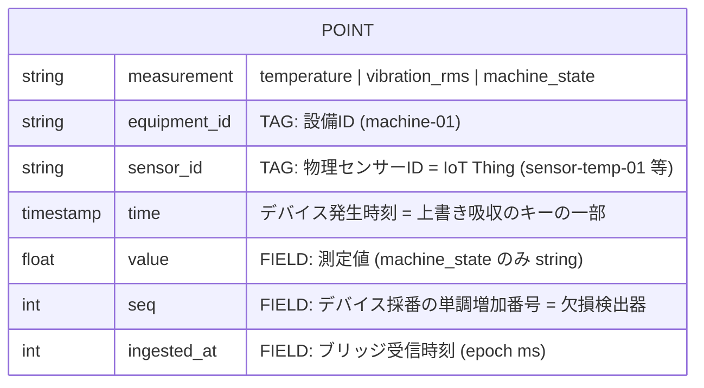

# データモデル: InfluxDB

**版**: 0.2 / **作成**: 2026-07-07 

## 1. 構造

- InfluxDB 2.x OSS(docker compose 内) / org: `virtual-factory` / bucket: `sensor_data`(保持期間 **30日**、仮置き)



| 項目 | 値 |
|---|---|
| measurement | センサー種別ごと: `temperature` / `vibration_rms` / `machine_state` |
| タグ | `equipment_id`, `sensor_id` |
| ポイント時刻 `time` | **デバイス発生時刻**(ペイロードの `time` をブリッジがそのまま採用) |
| フィールド | `value`(temperature: ℃ float, vibration_rms: mm/s float, machine_state: string)+ `seq`(int)+ `ingested_at`(epoch ms) |
| 保持期間 | bucket 30日(仮置き) |

送信ペイロード例(疑似センサー → IoT Core、ブリッジはこれを購読して書き込む):

```json
{
  "measurement": "temperature",
  "equipment_id": "machine-01",
  "sensor_id": "sensor-temp-01",
  "time": 1767589200000,
  "seq": 4213,
  "value": 68.4
}
```

## 2. 判断コメント(なぜこの粒度か)

### 2-1. ポイント時刻はデバイス発生時刻を主とする【ADR-001 の成立条件】
InfluxDB は「同一 measurement + 同一タグセット + 同一タイムスタンプ」の書き込みを同一ポイントへの上書きとして扱う。ブリッジ受信時刻を `time` に採ってしまうと、バッファからの再送は毎回別ポイントになり重複吸収が成立しない。デバイス発生時刻を採ることで、再送しても同一ポイント上書きとなり、二重計上なしとすることができる
受信時刻は捨てず `ingested_at` フィールドに併記する。`ingested_at - time` が伝送遅延・時刻ズレの観測量になる。

### 2-2. タグは 2 つで打ち止め
- `equipment_id`(監視対象の設備)と `sensor_id`(物理デバイス = IoT Thing = X.509 証明書の単位)は指す物が異なるため両方持つ。
- `site_id` / `line_id` 等の階層タグは**持たない**。工場 > ライン > 設備の階層表現は SiteWise アセットモデルの責務であり、時系列ストア側に重複して持つと二重管理になる。タグはシリーズのインデックスであり、検索キーだけを置く。

### 2-3. `seq` はフィールド(タグにしない)
- **seq の飛び = 欠損の可視化**。断→再送の後に seq が連続していれば回復の証明、飛んでいれば欠損の証明になる。Grafana に「seq ギャップ検出」パネルを 1 枚置く。

### 2-4. InfluxDB の保持期間について
InfluxDB は保持期間より古い `time` の書き込みを受け付けない。そのため送信バッファはInfluxDB の保持期間よりも短い時間を設定する必要がある。
