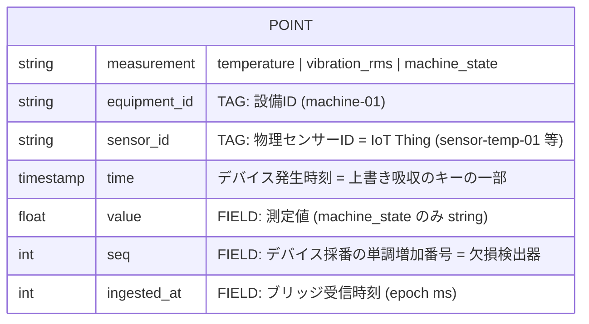

# データモデル設計: InfluxDB

**版**: 0.2 / **作成**: 2026-07-07 / **状態**: Phase 0 設計(数値パラメータは Phase 4 のコスト実測とセットで見直す)

方針: 全項目定義書にはしない。スキーマ 1 枚+「なぜこの粒度か」の判断コメントのみ。
本設計は ADR-001(重複吸収を InfluxDB の書き込み意味論で成立させる)の実装本体である。

---

## 1. 構造

- InfluxDB 2.x OSS(docker compose 内) / org: `virtual-factory` / bucket: `sensor_data`(保持期間 **30日**、仮置き)



| 項目 | 値 |
|---|---|
| measurement | センサー種別ごと: `temperature` / `vibration_rms` / `machine_state` |
| タグ | `equipment_id`, `sensor_id` |
| ポイント時刻 `time` | **デバイス発生時刻**(ペイロードの `ts` をブリッジがそのまま採用) |
| フィールド | `value`(temperature: ℃ float, vibration_rms: mm/s float, machine_state: string)+ `seq`(int)+ `ingested_at`(epoch ms) |
| 保持期間 | bucket 30日(仮置き) |

送信ペイロード例(疑似センサー → IoT Core、ブリッジはこれを購読して書き込む):

```json
{
  "equipment_id": "machine-01",
  "sensor_id": "sensor-temp-01",
  "ts": 1767589200000,
  "seq": 4213,
  "measure": "temperature",
  "value": 68.4
}
```

## 2. 判断コメント(なぜこの粒度か)

### 2-1. ポイント時刻はデバイス発生時刻を主とする【ADR-001 の成立条件】
InfluxDB は「同一 measurement + 同一タグセット + 同一タイムスタンプ」の書き込みを同一ポイントへの上書きとして扱う。ブリッジ受信時刻を `time` に採ると、バッファからの再送は毎回別ポイントになり重複吸収が成立しない。デバイス発生時刻を採ることで、再送 = 同一ポイント上書き = 二重計上なし、が成立する。
受信時刻は捨てず `ingested_at` フィールドに併記する。`ingested_at - time` が伝送遅延・時刻ズレの観測量になり、故障モード注入(断・再送)デモの効果測定に使う。なお再送時は `ingested_at` が最終到達時刻で上書きされるが、「最後に届いた時刻」として意味が通るため許容する。

### 2-2. タグは 2 つで打ち止め
`equipment_id`(監視対象の設備)と `sensor_id`(物理デバイス = IoT Thing = X.509 証明書の単位)は指す物が異なるため両方持つ。設備とデバイスの ID を混同しない、が IT/OT データ設計の基本線。
`site_id` / `line_id` 等の階層タグは**持たない**。工場 > ライン > 設備の階層表現は SiteWise アセットモデルの責務であり、時系列ストア側に重複して持つと二重管理になる。タグはシリーズのインデックスであり、検索キーだけを置く。

### 2-3. `seq` はフィールド(タグにしない)
単調増加値をタグに置くとシリーズのカーディナリティが爆発する、が消極的理由。積極的理由は **seq の飛び = 欠損の可視化**。断→再送の後に seq が連続していれば回復の証明、飛んでいれば欠損の証明になり、一点豪華主義(断・再送・重複吸収)の観測面を担う。Grafana に「seq ギャップ検出」パネルを 1 枚置く。

### 2-4. bucket 保持期間は再送の受け入れ可能期間を兼ねる【バッファ設計との連立】
InfluxDB は bucket の保持期間より古い `time` の書き込みを受け付けない。2-1 でデバイス時刻を主とした帰結として、長時間の断の後の再送は「古い時刻の書き込み」になるため、**デバイス側バッファの深さ・想定最大断時間・保持期間は独立に決められない**。
仮置き: 想定最大断 12h ≪ 保持期間 30日で、本規模では余裕が大きいが、保持期間を短縮する(容量・コスト都合)場合はこの連立が制約として現れる。README の「実際の工場と違う点」でも触れる(実工場では停電・保全停止で数日単位の断があり得る)。

### 2-5. measurement はセンサー種別で分ける
1 つの measurement に統合してタグで種別を持つ案もあるが、`machine_state` の値が string、他 2 系統が float であり、同一フィールドキーに型の異なる値を混ぜるとフィールド型の衝突を招く。種別 = measurement は InfluxDB の慣用にも沿い、クエリも素直になる。

## 3. この設計が意図的に扱わないこと

- ダウンサンプリング・集計タスク(本規模ではクエリ時集計で足りる。本番規模での事前集計は非機能設計文書に記載)
- スキーマレジストリ・ペイロードのバージョニング(センサーとブリッジが同一リポジトリ内にありスキーマ変更を自制御できるため)
